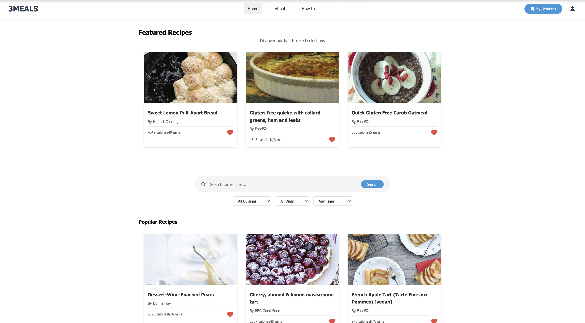

# 3MEALS - Recipe Search Application



3MEALS is a modern web application that allows users to search for recipes, save their favorites, and view detailed cooking instructions. Built with HTML, CSS, and JavaScript, it integrates with the Edamam API for recipe data and MongoDB Atlas for storing user favorites.

## Features

- **Recipe Search**: Search recipes with filters for cuisine type, diet, and cooking time
- **Featured Recipes**: Discover hand-picked recipe selections
- **Detailed Views**: Click any recipe to view detailed ingredients and instructions
- **Favorites System**: Save your favorite recipes for quick access
- **Responsive Design**: Works seamlessly on desktop and mobile devices

## Prerequisites

Before you begin, ensure you have the following:

- MongoDB Atlas account
- Edamam API credentials (APP_ID and APP_KEY)
- Node.js installed on your system

## Installation

1. Clone the repository:

```bash
git clone https://github.com/yourusername/3meals.git
cd 3meals
```

2. Install dependencies:

```bash
npm install
```

3. Create a `.env` file in the root directory:

```env
EDAMAM_APP_ID=your_edamam_app_id
EDAMAM_APP_KEY=your_edamam_api_key
MONGODB_URI=your_mongodb_connection_string
PORT=3000
```

4. Start the server:

```bash
npm run dev
```

## Project Structure

```
3MEALS/
├── public/
│   ├── css/
│   │   └── styles.css
│   ├── js/
│   │   └── app.js
│   └── index.html
├── models/
│   └── Recipe.js
├── .env
├── .gitignore
├── package.json
├── server.js
└── README.md
```

## Configuration

### MongoDB Atlas Setup

1. Create a cluster in MongoDB Atlas
2. Set up database access and network access
3. Get your connection string and add it to `.env`

### Edamam API Setup

1. Sign up at https://developer.edamam.com/
2. Create an application
3. Get your APP_ID and APP_KEY
4. Add them to your `.env` file

## Usage

1. **Search Recipes**: Use the search bar and filters to find recipes
2. **View Details**: Click on any recipe card to see full details
3. **Save Favorites**: Click the heart icon to save recipes to favorites
4. **Manage Favorites**: Access saved recipes through the "My Favorites" button

## Technologies Used

- Frontend:
  - HTML5
  - CSS3
  - JavaScript (ES6+)
  - Font Awesome Icons
- Backend:
  - Node.js
  - Express.js
  - MongoDB Atlas
  - Mongoose
- APIs:
  - Edamam Recipe API

## License

This project is licensed under the MIT License - see the [LICENSE](LICENSE) file for details.

## Acknowledgments

- Recipe data provided by [Edamam](https://www.edamam.com/)
- Icons from [Font Awesome](https://fontawesome.com/)
